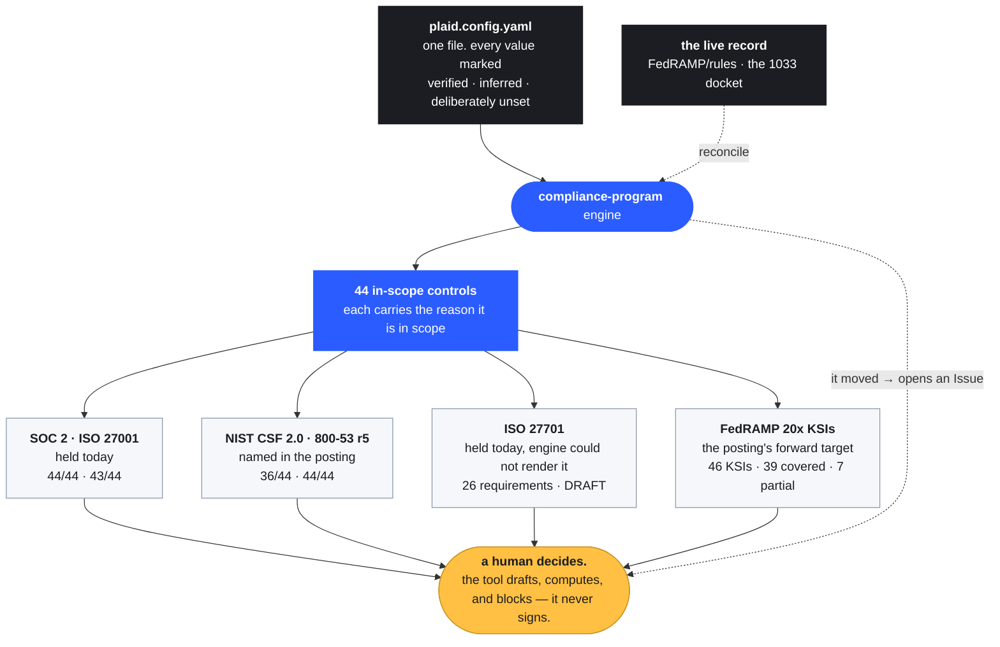

# Plaid's GRC Engineering Program, as Code

**Describes Plaid in one config file, renders it into a working GRC program, and ships the two framework mappings the posting names that the engine could not render. Building it surfaced two silent-failure defects in my own engine. Both are fixed, both have regression tests, and the tests fail if you revert the fix.**

[](../../actions/workflows/tests.yml)
[](../../security/code-scanning)
[](00-governance/)
[](https://github.com/tiffanidickerson437-lang/compliance-program)
[](#ground-rules)

**▶ [The walkthrough](https://tiffanidickerson437-lang.github.io/plaid-acd5e5/)** — the same argument in one page, matched to the posting line by line. Source: [`docs/index.html`](docs/index.html).

## Run it — 30 seconds, no key, no network

```bash
git clone https://github.com/tiffanidickerson437-lang/plaid-grc-engineering-program
cd plaid-grc-engineering-program && pip install pyyaml

python3 04-evidence-and-audit/data/ksi_coverage.py     # 46 FedRAMP 20x KSIs, resolved
python3 04-evidence-and-audit/data/strm_coverage.py    # 26 ISO 27701 requirements
```

```
FedRAMP 20x CR26 — 46 KSIs across 10 categories, resolved against 44 in-scope controls
  covered: 39   partial: 7
VALID — every KSI resolves, every partial names its delta, and no row
        asserts a company's implementation state.
```

Then attack the checkers themselves — `test_ksi_coverage.py` (17 tests) and
`test_strm_coverage.py` (16). Gut either validator to always-pass and its own suite turns red.

Same config, same mappings, same output every run. No model in the pass/fail path.

---

This is how I'd start the GRC Engineering role, built entirely from what Plaid already publishes.

Plaid is further along than most. The security organization has already built the pattern this role is meant to extend — [treating security like infrastructure](https://plaid.com/blog/security-as-a-platform/), where controls arrive as CI templates and Terraform modules that enforce themselves across every repository by default, and where a bug bounty finding becomes a permanent guardrail instead of a ticket. Where this repo points at a gap, it is a springboard for the next piece of work, never a knock on the work already done.

### The short version, in four lines

- **The posting names six framework families. Configure all six and my engine renders four.** ISO 27701 — which Plaid holds today — and FedRAMP 20x — which the posting points at — both dropped silently. [Both mappings now exist.](#the-gap-computed-not-asserted)
- **Plaid's compliance deadline does not exist.** The CFPB has been enjoined from enforcing the Section 1033 rule since 29 October 2025, and there is still no replacement proposal. [That is the argument for continuous compliance](00-governance/regulatory-clock.md), not against it.
- **Plaid already built the enforcement point for agent authorization.** Identity-aware proxy, call-time tool restrictions, short-lived DPoP tokens. What is not public is the control that governs it. [`AAT-01` maps onto it almost line for line.](02-ai-governance/)
- **Every checker here is tested by attacking it.** 33 tests. Gut any validator to always-pass and its own suite turns red.

## What it does



## Start here: the gap, computed not asserted

The posting asks for "the ability to map controls to evidence and crosswalk a single control across frameworks," and names six framework families: SOC 2, ISO 27001, ISO 27701, NIST CSF, NIST 800-53, and FedRAMP 20x.

I configured all six. The engine rendered four.

```bash
pip install pyyaml
python3 04-evidence-and-audit/data/ksi_coverage.py     # 46 KSIs, resolved
python3 04-evidence-and-audit/data/strm_coverage.py    # 26 ISO 27701 requirements
```

| Framework view | Controls carrying it | Coverage |
|---|---:|---:|
| SOC 2 (TSC 2017) | 44 / 44 | 100% |
| NIST SP 800-53 Rev.5 | 44 / 44 | 100% |
| ISO/IEC 27001:2022 | 43 / 44 | 97.7% |
| NIST CSF 2.0 | 36 / 44 | 81.8% |
| **ISO/IEC 27701** | **0** | **no mapping existed** |
| **FedRAMP 20x KSIs** | **0** | **not registered at all** |

The two that dropped are the two that matter. **ISO 27701 is a certification Plaid holds today** — it is on the trust center and the posting names it explicitly. **FedRAMP 20x** is what the posting points at as forward: *"positioning Plaid to meet continuous-compliance expectations as we enter new markets and pursue new authorizations."*

Both mappings now exist: [ISO 27701](mappings/iso27701.draft.yaml) as a governed STRM draft with 26 requirements, and [FedRAMP 20x](04-evidence-and-audit/data/fedramp-20x-ksi-mapping.yaml) with all 46 CR26 Key Security Indicators.

**Neither is presented as coverage.** The ISO 27701 mapping ships as `DRAFT_PENDING_HUMAN_APPROVAL` and the validator refuses to count a draft as satisfied coverage. It reports 9 requirements with complete coverage, **16 partial with the gap named**, and **1 with no coverage at all** — Annex B.8.2.4, the duty to tell a customer their own instruction appears to breach the law. Nothing in the engine covers that. Saying so is the point.

The coverage report emits **no single percentage**, deliberately. Averaging complete and partial relationships into one number destroys the only thing a reader needs: the list of what a human still has to design.

## The two defects this surfaced in my own engine

Both were found by using the engine, not by auditing it. Both are the class the posting describes — *"you dig into how controls can silently fail, drift, or get bypassed so you can catch it automatically."*

**01 — A fully-mapped framework silently reported as absent.** The crosswalk keys NIST 800-53 as `nist80053`. The renderer's normalizer recognized only `nist-800-53`, and its substring fallback tested for the literal `800-53`, which `nist80053` does not contain. Write the crosswalk's own spelling into a config and a framework with 100% control coverage vanishes from the payload — no exception, no warning, no log line. Every underscore-form crosswalk key had the same latent defect. **A control that can be reported as absent while fully mapped is a control that has silently failed.**

**02 — Silent data corruption on Windows.** Text I/O across the toolchain omitted an explicit encoding, so it fell back to cp1252. Writes crashed on the arrow character; reads were worse, decoding UTF-8 sources into mojibake without failing. `control-library.yaml` carries both a middot and an em-dash, so every narrative read on Windows was quietly corrupted. 21 I/O sites across 9 files.

Both are fixed upstream with a regression suite that includes a mutation guard. Revert either fix and the suite goes red — verified, not asserted.

## Against the posting's own responsibilities

| Responsibility (verbatim) | What is in here today |
|---|---|
| Architect GRC's Engineering Foundation — controls, policies and framework mappings as **structured, version-controlled data** | [44 controls](generated/companies/plaid/data.json) rendered from [one config](generated/companies/plaid/plaid.config.yaml), plus the [two mappings](mappings/) the engine was missing |
| "one control maps evidence across SOC 2, ISO, NIST, and beyond instead of being re-collected for every audit" | Six framework views over one control set. Adding a framework is a mapping, never a new control — which is why the KSI mapping [ported unchanged](04-evidence-and-audit/data/fedramp-20x-ksi-mapping.yaml) from a different company |
| Build **Continuous Controls Monitoring** — detection that flags drift against baseline | The drift-opens-an-Issue loop, plus `KSI-CNA-EIS` (Enforcing Intended State), whose mechanism this literally is |
| **Turn Data into Risk Signal** | FAIR Monte Carlo over the register — and see [the honest limitation](docs/deliverables.md) |
| Future-proof for **Continuous Compliance (FedRAMP 20x KSIs)** | All 46 CR26 KSIs mapped, 39 covered, 7 partial with each delta named |
| **Shift Compliance Left with Code and AI** | Policy-as-code in Rego with paired allow/deny fixtures, running in CI |
| Scale **agentic / AI-assisted workflows** | [The evidence boundary](02-ai-governance/) — and the reason AI never renders the pass/fail |

## Ground rules

1. **Public sources only.** Every claim traces to a public primary source checked 15 August 2026. Nothing is claimed about Plaid's internal posture; where something could not be verified it is an [open question](00-governance/open-questions.md). Seven plausible-sounding claims were checked and **refuted** during research — including the AES-256 encryption language and "Plaid Link means developers never handle credentials." Neither appears anywhere in this repo. [The list is published](00-governance/open-questions.md) so a reader can see what was rejected, not just what survived.
2. **Gaps are the work, never the criticism.** If it is visible from outside, it is visible to an auditor, a customer's security team, and a competitor.
3. **Evidence is computed, never authored.** No Plaid evidence exists in this repo and none is claimed. The `evidence_in_repo: none` line in the config is load-bearing. AI drafts narratives and mappings; **AI never renders a pass/fail** — and that is an engineering constraint with a citation, not a preference. See [02-ai-governance](02-ai-governance/).

## Where to look

| | |
|---|---|
| [`00-governance/`](00-governance/) | What the public record says, what it cannot say, and the regulatory clock that stopped |
| [`02-ai-governance/`](02-ai-governance/) | Why AI never renders the pass/fail, with the citations that make it a constraint |
| [`04-evidence-and-audit/`](04-evidence-and-audit/) | The instruments that run, and the mappings they validate |
| [`mappings/`](mappings/) | The two crosswalks the engine was missing, in STRM form |
| [`generated/`](generated/) | One config in, 44 controls and 6 framework views out |
| [`30-60-90/`](30-60-90/) | What I would run in the seat |

## Run it

```bash
pip install pyyaml

# the mappings, validated and rendered
python3 04-evidence-and-audit/data/ksi_coverage.py --render     # 46 FedRAMP 20x KSIs
python3 04-evidence-and-audit/data/strm_coverage.py --render    # 26 ISO 27701 requirements

# every checker, attacked
python3 04-evidence-and-audit/data/test_ksi_coverage.py         # 17 tests
python3 04-evidence-and-audit/data/test_strm_coverage.py        # 16 tests
```

Same config, same mappings, same output every run. No model in the pass/fail path.

---

*Built from public sources, 15 August 2026. Not affiliated with Plaid. No claim is made about Plaid's internal security posture, certificate scope, or audit outcomes — none of which are public.*
